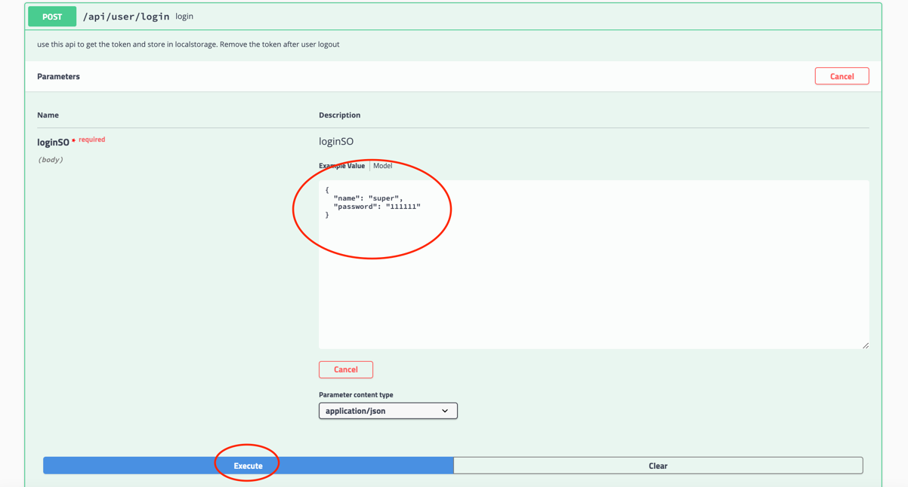
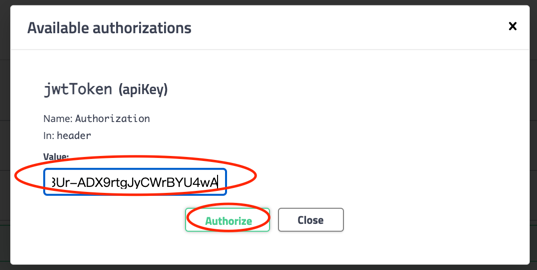

# sb-crm-demo

1. build jar
   ```
   1. go to the dir: /sb-crm-demo
   2. mvn clean package
   ```
3. run demo
   ```
   1. go to the dir: /sb-crm-demo/document
   2. docker-compose up -d
   ```
3. [open swagger](http://localhost:9100/swagger-ui.html#/)

4. get the platform user's token 

   4.1.login platform user
   
   | account | password |
   | :-----| ----: |
   | super | 111111 |
   | manager | 111111 |
   | operator | 111111 |

   
   4.2.copy the token
   
   4.3 authorize
   
   
   
5. start to add/update/delete the client or company data
   

